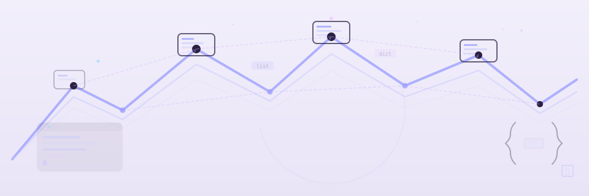

# API Reference



Programmatic access to analyzers, detectors, pipeline, and MCP server tools. All API documentation is generated from Google-style docstrings via mkdocstrings.

<div class="grid cards" markdown>

-   :material-layers:{ .lg .middle } **Analyzers**

    ---

    `BaseAnalyzer` and language-specific implementations using the Template Method pattern.

    [Analyzers](analyzers.md)

-   :material-shield-check:{ .lg .middle } **Detectors**

    ---

    174 `ViolationDetector` implementations across 15 languages — each a Strategy class.

    [Detectors](detectors.md)

-   :material-database-cog:{ .lg .middle } **Models**

    ---

    Pydantic models for `AnalysisResult`, `Violation`, `AnalysisContext`, and report contracts.

    [Models](models.md)

-   :material-pipe:{ .lg .middle } **Pipeline**

    ---

    `DetectionPipeline` orchestration, rule projection, and config merging.

    [Pipeline](pipeline.md)

-   :material-scale-balance:{ .lg .middle } **Rules**

    ---

    161 `ZenPrinciple` models and rule-to-detector mappings across all languages.

    [Rules](rules.md)

-   :material-api:{ .lg .middle } **Server Tools**

    ---

    MCP tool entry points: `analyze_zen_violations`, `generate_report`, `generate_prompts`.

    [Server](server.md)

</div>

## Quick usage

=== "Python"
    ```python
    from mcp_zen_of_languages.analyzers.analyzer_factory import AnalyzerFactory

    analyzer = AnalyzerFactory.create("python")
    result = analyzer.analyze(code)
    for violation in result.violations:
        print(f"{violation.severity}: {violation.message}")
    ```

=== "MCP"
    ```json
    {
      "tool": "analyze_zen_violations",
      "arguments": {
        "language": "python",
        "code": "def foo(): pass"
      }
    }
    ```

!!! info "Docstring quality"
    API pages are sourced from module docstrings and signatures. Keep `Args`, `Returns`, `See Also`, and `Examples` sections up to date for best output.

## See Also

- [User Guide](../user-guide/index.md) — CLI-first workflows and interpretation guidance.
- [Getting Started](../getting-started/index.md) — Installation and first analysis path.
- [Contributing](../contributing/index.md) — Architecture and detector extension workflows.
