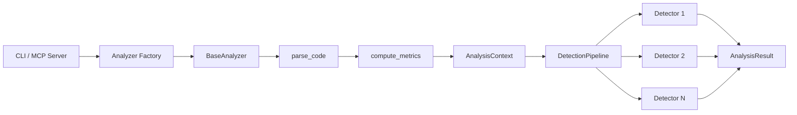

# Architecture

The analyzer architecture uses four design patterns working together. Understanding them makes contributing straightforward — you only need to touch the layer relevant to your change.

## Pattern overview

| Pattern | Where | Purpose |
|---------|-------|---------|
| **Template Method** | `BaseAnalyzer` | Defines the analysis algorithm — parse, compute metrics, detect, build result |
| **Strategy** | `ViolationDetector` subclasses | Each detector is an independent, testable unit |
| **Pipeline** | `DetectionPipeline` | Chains detectors, collects violations, handles errors per-detector |
| **Factory** | `AnalyzerFactory` | Creates the right analyzer for each language |

## Data flow



## Template Method: BaseAnalyzer

The base class defines the flow. Language-specific analyzers override two hooks:

```python
class BaseAnalyzer(ABC):
    def analyze(self, code, ...) -> AnalysisResult:
        context = self._create_context(...)
        context.ast_tree = self.parse_code(code)         # Hook 1
        metrics = self.compute_metrics(code, ast_tree)    # Hook 2
        violations = self.pipeline.run(context, config)
        return self._build_result(context, violations)

    @abstractmethod
    def parse_code(self, code: str) -> ParserResult | None: ...

    @abstractmethod
    def compute_metrics(self, code, ast_tree) -> tuple: ...
```

**Python** implements full AST parsing with cyclomatic complexity. All other languages implement regex-based detection with simpler metrics.

## Strategy: ViolationDetector

Each detector is a self-contained strategy — one class, one responsibility:

```python
class ViolationDetector(ABC):
    @abstractmethod
    def detect(self, context: AnalysisContext, config: DetectorConfig) -> list[Violation]: ...
```

Detectors are testable in isolation. You can construct an `AnalysisContext`, call `detect()`, and assert on the violations returned — no need to spin up the full pipeline.

## Pipeline: DetectionPipeline

The pipeline chains detectors and collects violations. If one detector raises an exception, the pipeline catches it and continues with the next — fail-safe by design.

## Factory: AnalyzerFactory

Maps language strings to analyzer classes:

```python
analyzer = AnalyzerFactory.create("python", config)
```

When adding a new language, register it in `analyzers/analyzer_factory.py`.

## Key source locations

| Component | Path |
|-----------|------|
| Base analyzer | `src/mcp_zen_of_languages/analyzers/base.py` |
| Detection pipeline | `src/mcp_zen_of_languages/analyzers/pipeline.py` |
| Analyzer factory | `src/mcp_zen_of_languages/analyzers/analyzer_factory.py` |
| Detector base | `src/mcp_zen_of_languages/analyzers/detectors/base.py` |
| Language modules | `src/mcp_zen_of_languages/languages/<lang>/` |
| Detector configs | `src/mcp_zen_of_languages/languages/configs.py` |
| Rule-detector registry | `src/mcp_zen_of_languages/analyzers/registry_bootstrap.py` |

## See Also

- [Adding a Language](adding-language.md) — Implement the two abstract methods
- [Adding a Detector](adding-detector.md) — Create a Strategy class and register it
- [Languages](../user-guide/languages/index.md) — See all 163 detectors across 14 languages
