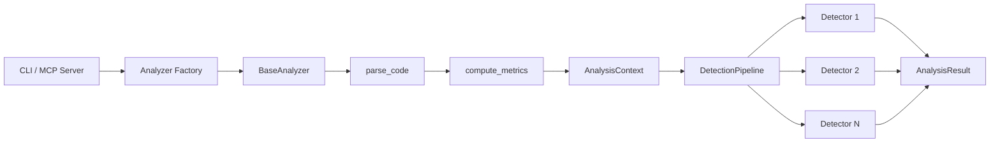

# Architecture

The analyzer architecture uses four design patterns working together. Understanding them makes contributing straightforward — you only need to touch the layer relevant to your change.

## Pattern overview

| Pattern | Where | Purpose |
|---------|-------|---------|
| **Template Method** | `BaseAnalyzer` | Defines the analysis algorithm — parse, compute metrics, detect, build result |
| **Strategy** | `ViolationDetector` subclasses | Each detector is an independent, testable unit |
| **Pipeline** | `DetectionPipeline` | Chains detectors, collects violations, handles errors per-detector |
| **Factory** | `AnalyzerFactory` | Creates the right analyzer for each language |

## Data flow


```mermaid
flowchart LR
    CLI[CLI / MCP Server] --> Factory[Analyzer Factory]
    Factory --> Analyzer[BaseAnalyzer]
    Analyzer --> Parse[parse_code]
    Parse --> Metrics[compute_metrics]
    Metrics --> Context[AnalysisContext]
    Context --> Pipeline[DetectionPipeline]
    Pipeline --> D1[Detector 1]
    Pipeline --> D2[Detector 2]
    Pipeline --> DN[Detector N]
    D1 --> Result[AnalysisResult]
    D2 --> Result
    DN --> Result
```

## Template Method: BaseAnalyzer

The base class defines the flow. Language-specific analyzers override two hooks:

```python
class BaseAnalyzer(ABC):
    def analyze(self, code, ...) -> AnalysisResult:
        context = self._create_context(...)
        context.ast_tree = self.parse_code(code)         # Hook 1
        metrics = self.compute_metrics(code, ast_tree)    # Hook 2
        violations = self.pipeline.run(context, config)
        return self._build_result(context, violations)

    @abstractmethod
    def parse_code(self, code: str) -> ParserResult | None: ...

    @abstractmethod
    def compute_metrics(self, code, ast_tree) -> tuple: ...
```

**Python** implements full AST parsing with cyclomatic complexity. All other languages implement regex-based detection with simpler metrics.

## Strategy: ViolationDetector

Each detector is a self-contained strategy — one class, one responsibility:

```python
class ViolationDetector(ABC):
    @abstractmethod
    def detect(self, context: AnalysisContext, config: DetectorConfig) -> list[Violation]: ...
```

Detectors are testable in isolation. You can construct an `AnalysisContext`, call `detect()`, and assert on the violations returned — no need to spin up the full pipeline.

## Pipeline: DetectionPipeline

The pipeline chains detectors and collects violations. If one detector raises an exception, the pipeline catches it and continues with the next — fail-safe by design.

## Factory: AnalyzerFactory

Maps language strings to analyzer classes:

```python
analyzer = AnalyzerFactory.create("python", config)
```

When adding a new language, register it in `analyzers/analyzer_factory.py`.

## Key source locations

| Component | Path |
|-----------|------|
| Base analyzer | `src/mcp_zen_of_languages/analyzers/base.py` |
| Detection pipeline | `src/mcp_zen_of_languages/analyzers/pipeline.py` |
| Analyzer factory | `src/mcp_zen_of_languages/analyzers/analyzer_factory.py` |
| Detector base | `src/mcp_zen_of_languages/analyzers/detectors/base.py` |
| Language modules | `src/mcp_zen_of_languages/languages/<lang>/` |
| Detector configs | `src/mcp_zen_of_languages/languages/configs.py` |
| Rule-detector registry | `src/mcp_zen_of_languages/analyzers/registry_bootstrap.py` |

## Dogma-to-Detector Mapping

Each of the [10 Dogmas of Zen](../user-guide/rules/the-ten-dogmas.md) maps to one or more **universal detector stubs** in the
`core/detectors/` package. These stubs define the *intent*; language-specific analyzers provide the *implementation*.

| Detector Domain | Dogmas Covered | Module |
|---|---|---|
| **Signature** | 1 Purpose, 2 Explicit Intent, 5 Meaningful Abstraction | `core/detectors/signature.py` |
| **Control Flow** | 3 Flat Traversal, 4 Loud Failures | `core/detectors/control_flow.py` |
| **State Mutation** | 7 Visible State, 8 Strict Fences | `core/detectors/state_mutation.py` |
| **Clutter** | 6 Unambiguous Naming, 9 Ruthless Deletion, 10 Proportionate Complexity | `core/detectors/clutter.py` |
| **Shared Keyword** | All (pattern-based) | `core/detectors/shared_keyword.py` |

Language-specific detectors (e.g., `NestingDepthDetector`, `GodClassDetector`,
`BareExceptDetector`) are the concrete implementations. The `DetectionPipeline`
orchestrates them using the Strategy pattern — each detector is a single concern,
testable, reorderable, and disableable independently.

The `registry_bootstrap` module bridges the gap: it scans all language zen
principles and registers a `RulePatternDetector` for any rule that lacks a
dedicated detector, ensuring every principle is at least heuristically covered.

## Three-Layer Architecture

```text
┌─────────────────────────────────────────────────────────────┐
│  UNIVERSAL DOGMAS (language-agnostic intent)                │
│  UniversalDogmaID enum — 10 canonical identifiers           │
├─────────────────────────────────────────────────────────────┤
│  LANGUAGE ADAPTERS (syntax/AST → dogma mapping)             │
│  BaseAnalyzer subclasses + DetectionPipeline                │
├─────────────────────────────────────────────────────────────┤
│  MCP / CLI TRANSPORT (structured output for agents/humans)  │
│  FastMCP server (15 tools) + zen CLI                        │
└─────────────────────────────────────────────────────────────┘
```

- **Universal layer**: dogmas are language-agnostic intent encoded as `UniversalDogmaID` values.
- **Adapter layer**: language analyzers map syntax/AST details into dogmas via `infer_dogmas_for_principle()`.
- **Transport layer**: CLI and MCP reporters expose findings as structured `ViolationReport` objects.

## Identifier Mapping Reference

Universal dogma constants in code use enum-style names in `UniversalDogmaID`:

| Enum Member | Canonical ID | Dogma Title |
|---|---|---|
| `UTILIZE_ARGUMENTS` | `ZEN-UTILIZE-ARGUMENTS` | Dogma of Purpose |
| `EXPLICIT_INTENT` | `ZEN-EXPLICIT-INTENT` | Dogma of Explicit Intent |
| `RETURN_EARLY` | `ZEN-RETURN-EARLY` | Dogma of Flat Traversal |
| `FAIL_FAST` | `ZEN-FAIL-FAST` | Dogma of Loud Failures |
| `RIGHT_ABSTRACTION` | `ZEN-RIGHT-ABSTRACTION` | Dogma of Meaningful Abstraction |
| `UNAMBIGUOUS_NAME` | `ZEN-UNAMBIGUOUS-NAME` | Dogma of Unambiguous Naming |
| `VISIBLE_STATE` | `ZEN-VISIBLE-STATE` | Dogma of Visible State |
| `STRICT_FENCES` | `ZEN-STRICT-FENCES` | Dogma of Strict Fences |
| `RUTHLESS_DELETION` | `ZEN-RUTHLESS-DELETION` | Dogma of Ruthless Deletion |
| `PROPORTIONATE_COMPLEXITY` | `ZEN-PROPORTIONATE-COMPLEXITY` | Dogma of Proportionate Complexity |

### Category-to-Dogma Mapping

The `_CATEGORY_TO_DOGMAS` table in `core/universal_dogmas.py` provides a
baseline mapping from `PrincipleCategory` to the most relevant dogma, enriched
at inference time by keyword scanning of violation and pattern descriptions.

| Category | Primary Dogma |
|---|---|
| Readability, Usability, Naming, Documentation | Unambiguous Naming |
| Clarity, Consistency, Type Safety, Configuration, Initialization, Debugging, Correctness | Explicit Intent |
| Complexity, Performance | Proportionate Complexity |
| Architecture, Idioms, Design, Functional | Meaningful Abstraction |
| Structure | Flat Traversal |
| Error Handling, Async, Safety, Robustness | Loud Failures |
| Immutability, Concurrency, Ownership, Memory Management | Visible State |
| Organization, Resource Management, Scope, Security | Strict Fences |

## References

- **Epic:** [#69 — 10 Dogmas of Zen](https://github.com/Anselmoo/mcp-zen-of-languages/issues/69)
- **Implementation PR:** [#73 — Core universal zen detector contracts](https://github.com/Anselmoo/mcp-zen-of-languages/pull/73)
- **Source code:** `src/mcp_zen_of_languages/core/universal_dogmas.py`

## See Also

- [Adding a Language](adding-language.md) — Implement the two abstract methods
- [Adding a Detector](adding-detector.md) — Create a Strategy class and register it
- [Philosophy](../getting-started/philosophy.md) — The architectural-coaching approach and motivation
- [The 10 Dogmas](../user-guide/rules/the-ten-dogmas.md) — Full dogma reference with rationale and anti-patterns
- [Languages](../user-guide/languages/index.md) — See programming, workflow, and config coverage at a glance
