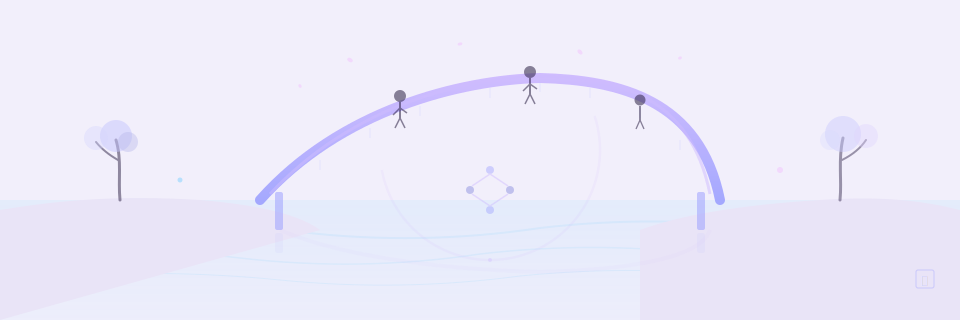

# Contributing



Thanks for improving MCP Zen of Languages. Whether you're fixing a bug, adding a detector, or bringing support for a new language — this section gives you the context to contribute effectively.

## Local development workflow

--8<-- "CONTRIBUTING.md:dev-workflow"

<div class="grid cards" markdown>

-   :material-hammer-wrench:{ .lg .middle } **Development**

    ---

    Local setup, quality gates, test commands, and CI expectations.

    [Development](development.md)

-   :material-translate-variant:{ .lg .middle } **Add a Language**

    ---

    Define zen principles, create an analyzer, wire detectors — step by step.

    [Adding a Language](adding-language.md)

-   :material-magnify-expand:{ .lg .middle } **Add a Detector**

    ---

    Implement a violation detector with the Strategy pattern and register it.

    [Adding a Detector](adding-detector.md)

-   :material-sitemap:{ .lg .middle } **Architecture**

    ---

    How Template Method, Strategy, Pipeline, and Factory patterns connect.

    [Architecture](architecture.md)

-   :material-palette:{ .lg .middle } **Rendering Guide**

    ---

    Rich/Typer output conventions and terminal UX patterns.

    [Rendering Style Guide](rendering-style-guide.md)

-   :material-theme-light-dark:{ .lg .middle } **Zensical Migration**

    ---

    Updated docs engine/build workflow and theme migration notes.

    [Zensical Migration](zensical-migration.md)

</div>

## Before opening a PR

!!! warning "Quality gates"
    Run these locally before pushing:

    ```bash
    uv run ruff check                # Lint
    uv run pytest                     # Tests
    uvx pre-commit run --all-files    # Pre-commit hooks
    ```

=== "Bug fix"
    Include a regression test and note the root cause in your PR description.

=== "New feature"
    Add documentation, usage examples, and update the rule/detector mapping if applicable.

=== "New detector"
    Follow the [Adding a Detector](adding-detector.md) guide. Include at least one positive and one negative test case.

!!! tip "Keep PRs focused"
    Scope each PR to one detector or one language. Reviewers can validate behavior and docs together when changes are contained.

## See Also

- [Zensical Migration](zensical-migration.md) — Theme migration and docs build workflow updates.
- [User Guide](../user-guide/index.md) — End-user documentation surfaces impacted by contributor changes.
- [API Reference](../api/index.md) — Generated API docs from docstrings.
