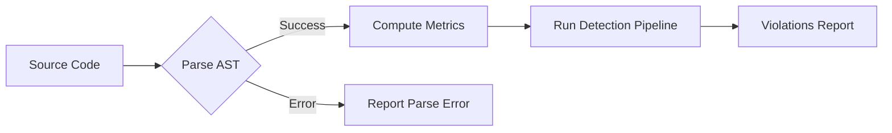
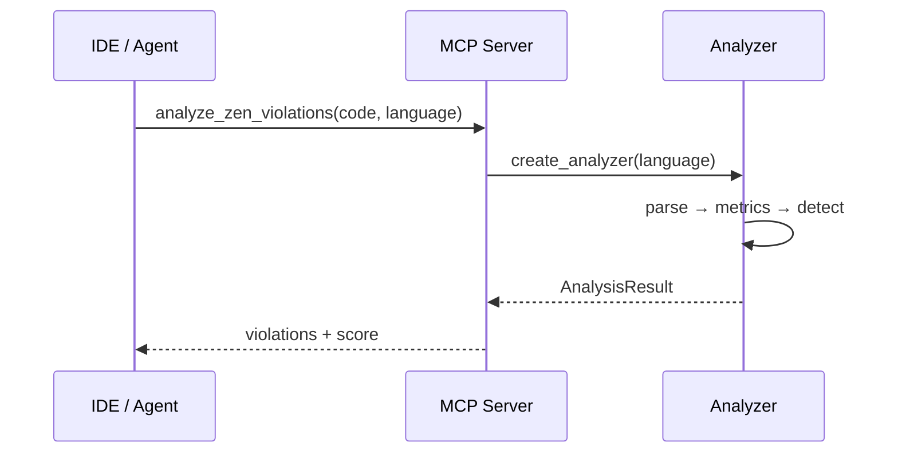

# Material Reference Examples

This page demonstrates mkdocs-material features available throughout the documentation.
Use it as a copy-paste reference when authoring new pages.

---

## :material-emoticon-outline: Icons & Emojis

Inline icons use the `:material-*:`, `:fontawesome-*:`, and `:octicons-*:` shortcodes.

| Syntax | Result |
|--------|--------|
| `:material-language-python:` | :material-language-python: |
| `:material-language-typescript:` | :material-language-typescript: |
| `:material-language-rust:` | :material-language-rust: |
| `:material-check-circle:` | :material-check-circle: |
| `:material-alert:` | :material-alert: |
| `:octicons-git-branch-16:` | :octicons-git-branch-16: |
| `:fontawesome-brands-github:` | :fontawesome-brands-github: |

Standard emoji works too: :rocket: :white_check_mark: :warning: :bulb:

!!! tip "Finding icons"
    Browse the full icon index at [mkdocs-material icon search](https://squidfunk.github.io/mkdocs-material/reference/icons-emojis/#search).

---

## :material-footnote: Footnotes

Use `[^label]` to create footnotes. They render at the bottom of the page automatically.

The zen analysis pipeline uses cyclomatic complexity[^1] and maintainability index[^2]
as core metrics.

[^1]: McCabe's cyclomatic complexity measures the number of linearly independent paths through source code.
[^2]: The maintainability index combines Halstead volume, cyclomatic complexity, and lines of code into a single score (0–100).

---

## :material-alert-box-outline: Admonitions

### Standard types

!!! note
    Use `note` for general information and context.

!!! tip
    Use `tip` for best-practice suggestions.

!!! info
    Use `info` for supplementary details.

!!! warning
    Use `warning` for things that could cause issues if ignored.

!!! danger
    Use `danger` for critical warnings — data loss, security risks, breaking changes.

!!! example
    Use `example` for concrete code demonstrations or worked scenarios.

!!! success
    Use `success` for confirmed-working patterns or passing states.

!!! failure
    Use `failure` for anti-patterns or known broken scenarios.

!!! bug
    Use `bug` for known issues or defects.

### Collapsible admonitions

Use `???` for collapsed-by-default, `???+` for expanded-by-default:

??? example "Collapsed example — click to expand"
    ```python
    from mcp_zen_of_languages.server import mcp

    result = await mcp.call_tool("analyze_zen_violations", {
        "code": "def foo(): pass",
        "language": "python",
    })
    ```

???+ warning "Expanded warning — click to collapse"
    Resource templates like `zen://rules/{language}` require a valid language parameter.
    Passing an unsupported language returns an error.

### Inline admonitions

!!! info inline end "Inline right"
    This admonition floats to the right of surrounding text.

Inline admonitions sit alongside paragraph text. Use `inline` for left-float
and `inline end` for right-float. They are useful for sidebar tips without
breaking the reading flow.

---

## :material-tab: Content Tabs

=== "Python"

    ```python
    from mcp_zen_of_languages import create_analyzer

    analyzer = create_analyzer("python")
    result = analyzer.analyze("def foo(): pass")
    print(result.violations)
    ```

=== "TypeScript"

    ```typescript
    // TypeScript analysis via MCP
    const result = await client.callTool("analyze_zen_violations", {
      code: "function foo() {}",
      language: "typescript",
    });
    ```

=== "Rust"

    ```rust
    // Rust analysis via MCP
    let result = client.call_tool("analyze_zen_violations", json!({
        "code": "fn foo() {}",
        "language": "rust",
    })).await?;
    ```

### Anchor-linked tabs

Content tabs can synchronize across the page when they share labels.
Click **Python** above and all tab groups with the same label switch together.

=== "Python"

    ```bash
    pip install mcp-zen-of-languages
    ```

=== "TypeScript"

    ```bash
    npm install @anthropic-ai/sdk
    ```

=== "Rust"

    ```bash
    cargo add mcp-client
    ```

---

## :material-chart-line: Diagrams

Mermaid diagrams render with the project's Caligo palette for both light and dark themes.

### Flowchart



### Sequence diagram



!!! tip "Diagram accessibility"
    Use descriptive node labels and keep diagrams small (≤ 10 nodes).
    For complex architectures, split into multiple focused diagrams rather than one monolithic chart.

---

## :material-link-variant: Cross-references

Link to other pages using relative paths:

- [Getting Started](../getting-started/index.md)
- [Language Guides](../user-guide/languages/index.md)
- [MCP Tools Reference](../user-guide/mcp-tools-reference.md)
- [Architecture](architecture.md)
- [Adding a Detector](adding-detector.md)

Link to API docs with `[]` references:

- [`AnalysisResult`](../api/models.md#mcp_zen_of_languages.models.AnalysisResult)

---

## Summary

| Feature | Syntax | Documentation |
|---------|--------|---------------|
| Icons | `:material-*:` | [Icons & Emojis](https://squidfunk.github.io/mkdocs-material/reference/icons-emojis/) |
| Footnotes | `[^label]` | [Footnotes](https://squidfunk.github.io/mkdocs-material/reference/footnotes/) |
| Admonitions | `!!! type` | [Admonitions](https://squidfunk.github.io/mkdocs-material/reference/admonitions/) |
| Content tabs | `=== "Label"` | [Content Tabs](https://squidfunk.github.io/mkdocs-material/reference/content-tabs/) |
| Diagrams | ```` ```mermaid ```` | [Diagrams](https://squidfunk.github.io/mkdocs-material/reference/diagrams/) |
