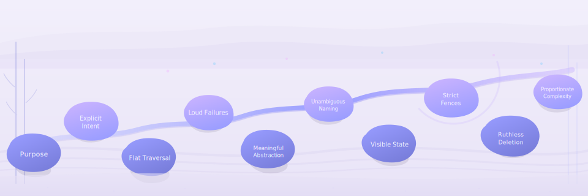

# Philosophy: The 10 Dogmas of Zen

`mcp-zen-of-languages` treats static analysis as **architectural coaching**, not just linting.
In AI-assisted coding, fast iteration increases the risk of hidden complexity.
These dogmas are guardrails that MCP tools can return as structured, teachable feedback.

!!! info "Scope and placement"
    This page defines the **cross-language philosophy layer** (above individual language guides).
    Language-specific do/don't guidance, per-language rules, and implementation details belong in
    [Languages](../user-guide/languages/index.md).

---

## The 10 Dogmas

### 1. Dogma of Purpose — `ZEN-UTILIZE-ARGUMENTS`

> Every argument must be used or removed.

**Rationale.** Unused parameters signal dead intent. They mislead readers about a
function's contract and accumulate as noise during refactors. In AI-assisted
workflows, an agent generating a function signature should never leave behind
vestigial parameters.

**Anti-patterns:**

- Accepting a parameter that is never referenced in the body.
- Keeping deprecated arguments "for compatibility" without a migration path.
- Forwarding `**kwargs` solely to suppress linter warnings about unused names.

---

### 2. Dogma of Explicit Intent — `ZEN-EXPLICIT-INTENT`

> Avoid magic behavior and hidden assumptions.

**Rationale.** Implicit behavior — type coercion, default mutations, hidden
global state — creates cognitive load that compounds across a codebase. When an
AI assistant reviews code, explicit intent makes violations unambiguous and fixes
mechanical.

**Anti-patterns:**

- Relying on mutable default arguments (`def f(x=[])`).
- Star-imports that hide the origin of names.
- Magic numbers without named constants.
- Implicit type conversions that silently change semantics.

---

### 3. Dogma of Flat Traversal — `ZEN-RETURN-EARLY`

> Prefer guard clauses over deep nesting.

**Rationale.** Deeply nested code forces readers to maintain a mental stack of
conditions. Guard clauses flatten the control flow and highlight the happy path.
Detectors can measure nesting depth mechanically, making this an ideal candidate
for automated enforcement.

**Anti-patterns:**

- `if`/`else` chains nested three or more levels deep.
- Wrapping entire function bodies in a single top-level `if`.
- Failing to invert negative conditions into early returns.

---

### 4. Dogma of Loud Failures — `ZEN-FAIL-FAST`

> Never silently swallow errors.

**Rationale.** Silent failures turn bugs into mysteries. When errors surface
immediately, root-cause analysis becomes trivial. This is especially critical in
MCP workflows where an agent may not observe side effects that a human would
notice in a debugger.

**Anti-patterns:**

- Bare `except: pass` blocks.
- Catching broad exception types without logging or re-raising.
- Returning `None` as a silent error sentinel instead of raising.
- Using `.unwrap()` (Rust) or force-unwrapping (Swift) without context.

---

### 5. Dogma of Meaningful Abstraction — `ZEN-RIGHT-ABSTRACTION`

> Avoid flag-heavy abstractions.

**Rationale.** A boolean parameter that toggles behavior is two functions wearing
one name. Premature or incorrect abstraction is worse than duplication — it
couples unrelated concerns and makes extension fragile.

**Anti-patterns:**

- Functions with boolean `mode` flags that switch between unrelated behaviors.
- God Classes with dozens of methods spanning multiple responsibilities.
- Deep inheritance hierarchies where base classes know about leaf details.
- Circular dependencies between modules.

---

### 6. Dogma of Unambiguous Naming — `ZEN-UNAMBIGUOUS-NAME`

> Clarity over clever shorthand.

**Rationale.** Names are the primary API for understanding code. Ambiguous or
overly short identifiers force readers to trace definitions. For AI assistants
consuming code via MCP, clear names reduce hallucination risk.

**Anti-patterns:**

- Single-letter variable names outside trivial loop counters.
- Abbreviations that save keystrokes but cost comprehension (`mgr`, `ctx`, `impl`).
- Naming style violations for the language (e.g., `camelCase` in Python).
- Inconsistent naming conventions across a project.

---

### 7. Dogma of Visible State — `ZEN-VISIBLE-STATE`

> Make mutation explicit and predictable.

**Rationale.** Hidden mutation — global state changes, in-place modifications
without clear signals — is the leading cause of "works on my machine" bugs.
Visible state makes data flow traceable and diffs reviewable.

**Anti-patterns:**

- Mutating function arguments in place without documenting it.
- Global mutable singletons accessed from multiple modules.
- Implicit state changes through property setters that trigger side effects.
- Shadowing variables in nested scopes, creating ambiguity about which binding is alive.

---

### 8. Dogma of Strict Fences — `ZEN-STRICT-FENCES`

> Preserve encapsulation boundaries.

**Rationale.** Module and class boundaries exist to manage complexity. Breaking
encapsulation — accessing private members, circular imports, leaking internal
types — turns architecture diagrams into lies.

**Anti-patterns:**

- Accessing private/protected members from outside the owning module.
- Circular import dependencies between packages.
- Exposing internal implementation types in public APIs.
- Namespace pollution through wildcard re-exports.

---

### 9. Dogma of Ruthless Deletion — `ZEN-RUTHLESS-DELETION`

> Remove dead and unreachable code.

**Rationale.** Dead code is technical debt with zero value. It misleads readers,
inflates coverage metrics, and creates phantom dependencies. Version control
preserves history — there is no reason to keep unused code in the working tree.

**Anti-patterns:**

- Commented-out code blocks left "just in case."
- Functions or classes that are defined but never called.
- Feature flags that are permanently off with no cleanup plan.
- Unreachable branches after an unconditional return.

---

### 10. Dogma of Proportionate Complexity — `ZEN-PROPORTIONATE-COMPLEXITY`

> Choose the simplest design that works.

**Rationale.** Complexity must be justified by requirements, not by speculative
generality. High cyclomatic complexity, long functions, and over-engineered
abstractions all increase the cost of every future change.

**Anti-patterns:**

- Functions with cyclomatic complexity exceeding a configured threshold.
- Functions longer than a screen (configurable, default ~50 lines).
- Premature introduction of design patterns without a concrete need.
- Over-parameterized configurations when sensible defaults suffice.

---

!!! info "Implementation details"
    How these dogmas map to detector stubs, the three-layer architecture, and the
    `UniversalDogmaID` enum reference are covered in
    [Architecture](../contributing/architecture.md#dogma-to-detector-mapping).

!!! tip "Using dogmas in an MCP workflow"
    The Analyze → Explain → Act workflow powered by these dogmas is shown in
    [Understanding Violations](../user-guide/understanding-violations.md#mcp-workflow).

## Cross-Language Rule Mapping

Each dogma is implemented by language-specific rules across the supported languages.
The tables below are **auto-generated** from the codebase's `infer_dogmas_for_principle()` mapping.

--8<-- "docs/includes/generated/dogma-mapping.md"

## See Also

- [Understanding Violations](../user-guide/understanding-violations.md) — severity scores, worked examples, and the MCP workflow
- [Architecture](../contributing/architecture.md) — how dogmas drive detector and pipeline design
- [Languages](../user-guide/languages/index.md) — per-language principles derived from these dogmas
