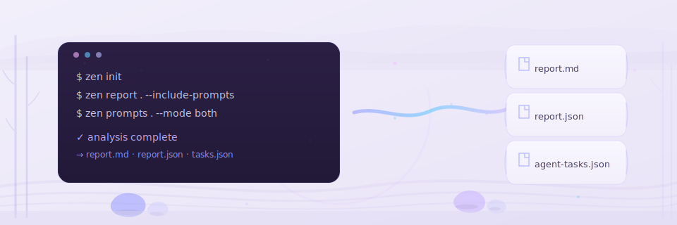

# CLI Reference



> **Auto-generated** from [`cli.py`](https://github.com/Anselmoo/mcp-zen-of-languages/blob/main/src/mcp_zen_of_languages/cli.py). Do not edit manually.
>
> Regenerate with: `uv run python scripts/generate_cli_docs.py`

The CLI is available as `zen` (short alias) or `mcp-zen-of-languages`. It is the local/CI interface for the same analysis capabilities exposed through MCP tools. All commands support `--quiet` to suppress Rich panels and banners.

!!! info "MCP-first workflow"
    If you're using an MCP-capable editor or agent, start with [MCP Tools Reference](mcp-tools-reference.md). Use the CLI when you need local checks, export artifacts, or CI automation.

## Commands at a glance

| Command | Purpose |
|---------|--------|
| `zen check` | Run zen analysis for a path with optional CI gating and machine output. |
| `zen export-mapping` | Export rule-to-detector mappings as a Rich table or JSON payload. |
| `zen init` | Interactively scaffold a ``zen-config.yaml`` and optional VS Code integration. |
| `zen list-rules` | Display a table of zen rule IDs, severities, and principle texts. |
| `zen prompts` | Turn analysis violations into actionable remediation prompts or agent tasks. |
| `zen reports` | Generate a comprehensive analysis report for a file or directory. |

## :material-magnify: Analysis Commands

### zen check {{ #check }}

```bash
zen check <PATH> [--language <TEXT>] [--config <TEXT>] [--format terminal|json|sarif] [--out <TEXT>] [--fail-on-severity <INTEGER RANGE>]
```

Run zen analysis for a path with optional CI gating and machine output.

**Options:**

| Option | Default | Description |
|--------|---------|-------------|
| `--language <TEXT>` | — | Override language detection |
| `--config <TEXT>` | — | Path to zen-config.yaml |
| `--format terminal|json|sarif` | `terminal` | Output format |
| `--out <TEXT>` | — | Write output to file |
| `--fail-on-severity <INTEGER RANGE>` | — | Exit with code 1 when any violation has severity >= this threshold |

**Returns:** int: Exit code ``0`` on success, ``1`` for severity-gated failure, and ``2`` for input/target errors.

---

### zen prompts {{ #prompts }}

```bash
zen prompts <PATH> [--language <TEXT>] [--config <TEXT>] [--mode remediation|agent|both] [--export-prompts <TEXT>] [--export-agent <TEXT>] [--severity <INTEGER>]
```

Turn analysis violations into actionable remediation prompts or agent tasks.

**Options:**

| Option | Default | Description |
|--------|---------|-------------|
| `--language <TEXT>` | — | Override language detection |
| `--config <TEXT>` | — | Path to zen-config.yaml |
| `--mode remediation|agent|both` | `remediation` | Prompt generation mode |
| `--export-prompts <TEXT>` | — | Write prompts markdown to file |
| `--export-agent <TEXT>` | — | Write agent JSON to file |
| `--severity <INTEGER>` | — | Minimum severity threshold |

**Returns:** int: Process exit code — ``0`` on success, ``2`` on input errors.

---

### zen reports {{ #reports }}

```bash
zen reports <PATH> [--language <TEXT>] [--config <TEXT>] [--format markdown|json|both|sarif] [--out <TEXT>] [--export-json <TEXT>] [--export-markdown <TEXT>] [--export-log <TEXT>] [--include-prompts] [--skip-analysis] [--skip-gaps]
```

Generate a comprehensive analysis report for a file or directory.

**Options:**

| Option | Default | Description |
|--------|---------|-------------|
| `--language <TEXT>` | — | Override language detection |
| `--config <TEXT>` | — | Path to zen-config.yaml |
| `--format markdown|json|both|sarif` | `markdown` | Output format |
| `--out <TEXT>` | — | Write output to file |
| `--export-json <TEXT>` | — | Write report JSON to file |
| `--export-markdown <TEXT>` | — | Write report markdown to file |
| `--export-log <TEXT>` | — | Write log summary to file |
| `--include-prompts` | — | Include remediation prompts |
| `--skip-analysis` | — | Skip analysis details in report |
| `--skip-gaps` | — | Skip gap analysis |

**Returns:** int: Process exit code — ``0`` on success, ``2`` on input errors.

---

## :material-cog-outline: Configuration Commands

### zen export-mapping {{ #export-mapping }}

```bash
zen export-mapping [--out <TEXT>] [--languages <TEXT>] [--format terminal|json]
```

Export rule-to-detector mappings as a Rich table or JSON payload.

**Options:**

| Option | Default | Description |
|--------|---------|-------------|
| `--out <TEXT>` | — | Write output to file |
| `--languages <TEXT>` | — | Filter by languages |
| `--format terminal|json` | `terminal` | Output format |

**Returns:** int: Process exit code — always ``0``.

---

### zen init {{ #init }}

```bash
zen init [--force] [--yes] [--languages <TEXT>] [--strictness relaxed|moderate|strict]
```

Interactively scaffold a ``zen-config.yaml`` and optional VS Code integration.

**Options:**

| Option | Default | Description |
|--------|---------|-------------|
| `--force` | — | Overwrite existing config |
| `--yes` | — | Skip prompts and use defaults |
| `--languages <TEXT>` | — | Languages to include (repeatable) |
| `--strictness relaxed|moderate|strict` | `moderate` | Strictness: relaxed|moderate|strict |

**Returns:** int: Process exit code — ``0`` on success, ``2`` if the file exists without ``--force``.

---

### zen list-rules {{ #list-rules }}

```bash
zen list-rules <LANGUAGE>
```

Display a table of zen rule IDs, severities, and principle texts.

**Returns:** int: Process exit code — ``0`` on success, ``2`` if the language is unknown.

---

## Global Options

| Flag | Description |
|------|-------------|
| `--quiet`, `-q` | Suppress banner, Rich panels, and decorative output |
| `--verbose`, `-v` | Show rich tracebacks with local variable inspection |
| `--help` | Show help for any command |
| `--version` | Print version number |

## Exit Codes

| Code | Meaning |
|------|--------|
| `0` | Success — no violations above the configured threshold |
| `1` | Violations found above the severity threshold |
| `2` | Invalid configuration or arguments |
