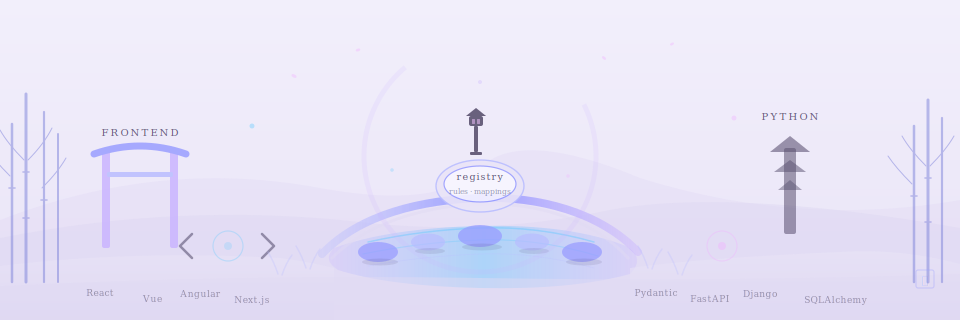

# Frameworks

Zen of Languages is still fundamentally organized around **language keys**, but several ecosystems are important enough to expose as first-class framework analyzers.

That means framework support is modeled as dedicated analyzers such as `react`, `fastapi`, or `django`, with their implementation modules living under `frameworks/<key>/...` while still plugging into the same registry, detector, and documentation pipeline.

The practical goal is simple: keep **parent-language semantics** and **framework-specific idioms** separate.

- TypeScript and JavaScript continue to represent the base languages
- React, Vue, Angular, and Next.js document the framework rules layered on top
- Python continues to represent the base language
- Pydantic, FastAPI, Django, and SQLAlchemy capture the framework-level conventions those ecosystems expect

## Supported Framework Analyzers

### Frontend

- [React](react.md)
- [Vue](vue.md)
- [Angular](angular.md)
- [Next.js](nextjs.md)

### Python ecosystem

- [Pydantic](pydantic.md)
- [FastAPI](fastapi.md)
- [Django](django.md)
- [SQLAlchemy](sqlalchemy.md)

## Detection Model

Framework routing is intentionally conservative:

- high-confidence file extensions like `.vue` route automatically
- strong file-name or project markers can route files such as Next.js pages
- import-based heuristics can elevate Python files into framework analyzers
- ambiguous files can still be analyzed by choosing `--language <framework>` explicitly

## Why this split helps

Framework analyzers now document and load as their own family, which makes a few things clearer:

- docs match the runtime architecture
- framework rules no longer appear as if they were base-language rules
- detector mappings can stay specific to the framework instead of pretending to be universal language overlays
- future framework additions have one obvious place to live in both code and docs

## Why frameworks have their own namespace

The repository now distinguishes between core language analyzers and framework analyzers:

- core languages continue to live under `languages/<key>/...`
- framework analyzers live under `frameworks/<key>/...`

Shared loaders, docs generators, and validation scripts understand both namespaces, which keeps framework support explicit without breaking the rest of the product.
