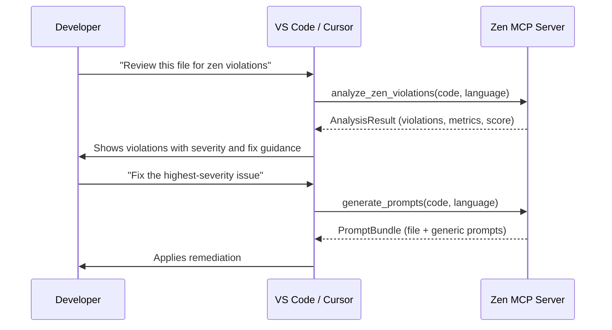
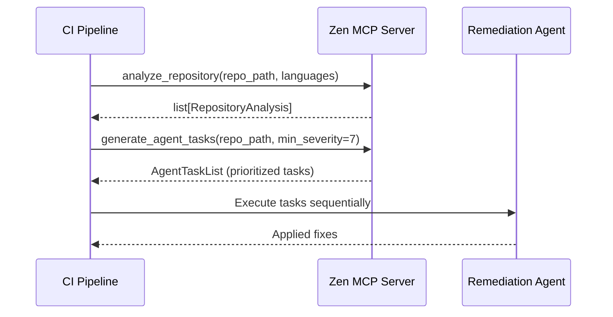
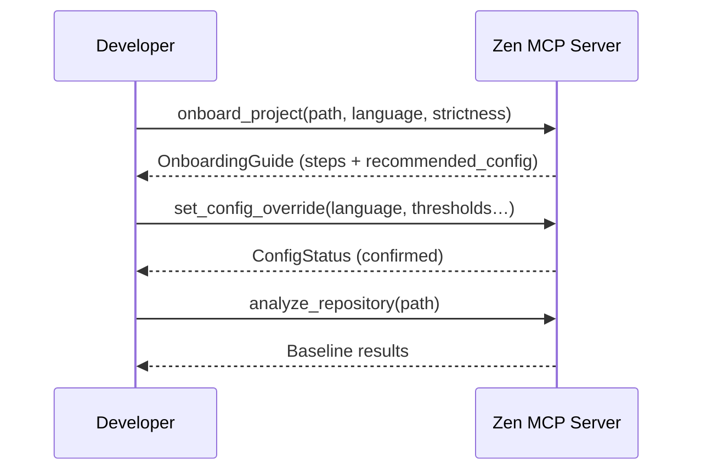
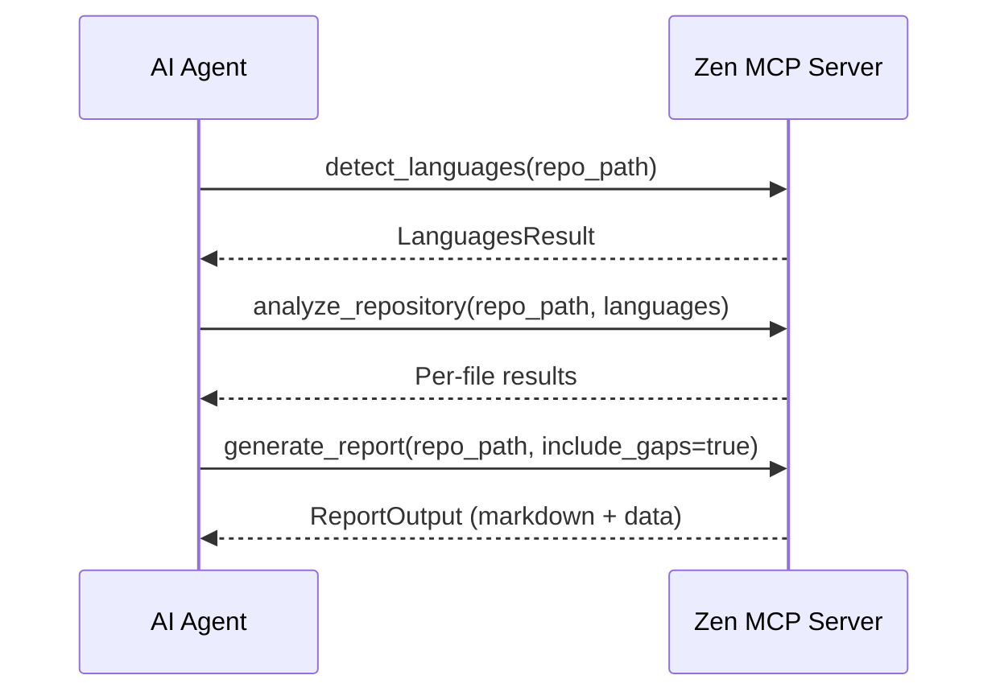
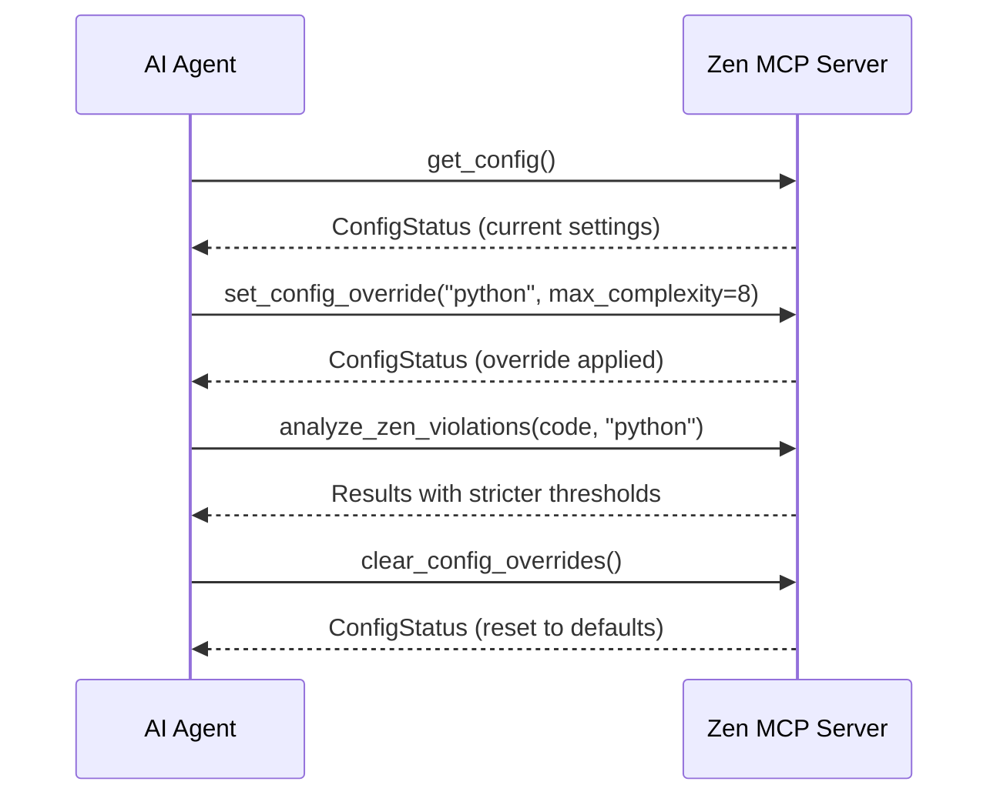

# MCP Tools Reference

> **Auto-generated** from [`server.py`](https://github.com/Anselmoo/mcp-zen-of-languages/blob/main/src/mcp_zen_of_languages/server.py). Do not edit manually.
>
> Regenerate with: `uv run python scripts/generate_mcp_tools_docs.py`

The MCP server exposes **tools**, **resources**, and **prompts** that AI agents
and IDE integrations can invoke via the
[Model Context Protocol](https://modelcontextprotocol.io/).

## Surface Summary

| Capability    | Count |
| ------------- | :---: |
| **Tools**     |  13   |
| **Resources** |   3   |
| **Prompts**   |   1   |

## Quick Reference

| Tool                                                            | Family        | Description                                                                                                                                       | Access                                                 |
| --------------------------------------------------------------- | ------------- | ------------------------------------------------------------------------------------------------------------------------------------------------- | ------------------------------------------------------ |
| [`analyze_zen_violations`](#analyze-zen-violations)             | Analysis      | Analyze a code snippet against zen rules and return analysis results.                                                                             | :material-eye-outline:{ title="Read-only" } Read-only  |
| [`analyze_repository`](#analyze-repository)                     | Analysis      | Analyze a repository path and return per-file analysis results.                                                                                   | :material-eye-outline:{ title="Read-only" } Read-only  |
| [`check_architectural_patterns`](#check-architectural-patterns) | Analysis      | Return detected architectural patterns for a code snippet.                                                                                        | :material-eye-outline:{ title="Read-only" } Read-only  |
| [`generate_prompts`](#generate-prompts)                         | Reporting     | Generate remediation prompts from zen analysis results.                                                                                           | :material-eye-outline:{ title="Read-only" } Read-only  |
| [`generate_agent_tasks`](#generate-agent-tasks)                 | Reporting     | Convert zen violations into structured agent task lists for automated remediation.                                                                | :material-eye-outline:{ title="Read-only" } Read-only  |
| [`generate_report`](#generate-report)                           | Reporting     | Generate a markdown/json report with gap analysis and prompts.                                                                                    | :material-eye-outline:{ title="Read-only" } Read-only  |
| [`get_config`](#get-config)                                     | Configuration | Return the current server configuration including any runtime overrides.                                                                          | :material-eye-outline:{ title="Read-only" } Read-only  |
| [`set_config_override`](#set-config-override)                   | Configuration | Override configuration values for a specific language at runtime. Overrides persist for the session.                                              | :material-pencil-outline:{ title="Mutating" } Mutating |
| [`clear_config_overrides`](#clear-config-overrides)             | Configuration | Clear all runtime configuration overrides, reverting to zen-config.yaml defaults.                                                                 | :material-pencil-outline:{ title="Mutating" } Mutating |
| [`detect_languages`](#detect-languages)                         | Metadata      | Return supported language list for analysis.                                                                                                      | :material-eye-outline:{ title="Read-only" } Read-only  |
| [`export_rule_detector_mapping`](#export-rule-detector-mapping) | Metadata      | Generate rule-detector mapping JSON from the live registry.                                                                                       | :material-eye-outline:{ title="Read-only" } Read-only  |
| [`get_supported_languages`](#get-supported-languages)           | Metadata      | Return list of all languages with zen rules and their detector coverage.                                                                          | :material-eye-outline:{ title="Read-only" } Read-only  |
| [`onboard_project`](#onboard-project)                           | Onboarding    | Get interactive onboarding guidance for setting up zen analysis on a project. Returns recommended configuration based on project characteristics. | :material-eye-outline:{ title="Read-only" } Read-only  |

## :material-magnify: Analysis Tools

### `analyze_zen_violations` { #analyze-zen-violations }

:material-eye-outline:{ title="Read-only" } Read-only analysis snippet zen

Analyze a code snippet against zen rules and return analysis results.

Run the full zen analysis pipeline on a single code snippet.

**Parameters:**

| Parameter            | Description                                                                                                                                |
| -------------------- | ------------------------------------------------------------------------------------------------------------------------------------------ |
| `code`               | Raw source code to analyse — typically the full contents of a single file read by the MCP client.                                          |
| `language`           | Target language identifier such as `"python"` or `"tsx"`. Aliases like `"ts"` and `"rs"` are accepted.                                     |
| `severity_threshold` | Floor severity that downstream consumers (reports, task generators) should honour. Falls back to `CONFIG.severity_threshold` when omitted. |

**Returns:** AnalysisResult carrying metrics, a scored violation list, and the computed `overall_score` (0–100 scale, higher is better).

---

### `analyze_repository` { #analyze-repository }

:material-eye-outline:{ title="Read-only" } Read-only analysis repository

Analyze a repository path and return per-file analysis results.

Analyse every eligible file in a repository and return per-file results.

**Parameters:**

| Parameter   | Description                                                                                             |
| ----------- | ------------------------------------------------------------------------------------------------------- |
| `repo_path` | Absolute path to the repository root. The MCP client typically resolves this from the active workspace. |
| `languages` | Restrict analysis to specific language identifiers. Defaults to `["python"]` internally.                |
| `max_files` | Per-language cap on the number of files to analyse, protecting against excessive runtime on monorepos.  |
| `ctx`       | Optional FastMCP context for progress and log updates during repository analysis.                       |

**Returns:** List of `RepositoryAnalysis` entries, each pairing a file path and language with its `AnalysisResult`.

---

### `check_architectural_patterns` { #check-architectural-patterns }

:material-eye-outline:{ title="Read-only" } Read-only analysis patterns

Return detected architectural patterns for a code snippet.

Scan a code snippet for recognised architectural patterns.

**Parameters:**

| Parameter  | Description                                                                               |
| ---------- | ----------------------------------------------------------------------------------------- |
| `code`     | Source fragment to inspect for structural patterns.                                       |
| `language` | Language identifier guiding which pattern recognisers to apply (e.g. `"python"`, `"go"`). |

---

## :material-file-document-outline: Reporting Tools

### `generate_prompts` { #generate-prompts }

:material-eye-outline:{ title="Read-only" } Read-only prompts remediation

Generate remediation prompts from zen analysis results.

Analyse code and synthesise remediation prompts for each detected violation.

**Parameters:**

| Parameter  | Description                                                                                              |
| ---------- | -------------------------------------------------------------------------------------------------------- |
| `code`     | Source code whose violations will drive prompt generation — should match the snippet passed to analysis. |
| `language` | Language identifier used to select the correct analyzer and prompt templates (e.g. `"python"`).          |

**Returns:** PromptBundle holding `file_prompts` with per-violation remediation text and `generic_prompts` for broader guidance.

---

### `generate_agent_tasks` { #generate-agent-tasks }

:material-eye-outline:{ title="Read-only" } Read-only agent automation tasks

Convert zen violations into structured agent task lists for automated remediation.

Convert repository-level violations into prioritised remediation tasks.

**Parameters:**

| Parameter      | Description                                                                                    |
| -------------- | ---------------------------------------------------------------------------------------------- |
| `repo_path`    | Absolute path to the repository to scan. All eligible source files are discovered recursively. |
| `languages`    | Restrict scanning to these languages. Omit to analyse only Python files by default.            |
| `min_severity` | Severity floor (1–10 scale). Violations below this threshold are excluded from the task list.  |

**Returns:** AgentTaskList containing prioritised tasks ready for automated remediation, sorted from highest to lowest severity.

---

### `generate_report` { #generate-report }

:material-eye-outline:{ title="Read-only" } Read-only analysis reporting

Generate a markdown/json report with gap analysis and prompts.

Produce a structured markdown report combining analysis, gaps, and prompts.

**Parameters:**

| Parameter          | Description                                                                                              |
| ------------------ | -------------------------------------------------------------------------------------------------------- |
| `target_path`      | Path to a single file or a directory. When a directory is given, all eligible files inside are analysed. |
| `language`         | Explicit language override. When omitted, the language is inferred from file extensions.                 |
| `include_prompts`  | Append remediation prompt sections derived from `build_prompt_bundle`.                                   |
| `include_analysis` | Include the violation-analysis body showing per-rule findings.                                           |
| `include_gaps`     | Include quality-gap and coverage-gap summaries highlighting areas that need attention.                   |
| `ctx`              | Optional FastMCP context used to emit progress and log updates for analyzed targets.                     |

**Returns:** ReportOutput with `markdown` (rendered report text) and `data` (structured dict) ready for MCP client consumption.

---

## :material-cog-outline: Configuration Tools

### `get_config` { #get-config }

:material-eye-outline:{ title="Read-only" } Read-only config metadata

Return the current server configuration including any runtime overrides.

Return a snapshot of the running server's configuration.

**Returns:** ConfigStatus describing active languages, severity threshold, resolved config file path, and a per-language map of overrides.

---

### `set_config_override` { #set-config-override }

:material-pencil-outline:{ title="Mutating" } Mutating config settings

Override configuration values for a specific language at runtime. Overrides persist for the session.

Apply session-scoped threshold overrides for a specific language.

**Parameters:**

| Parameter                   | Description                                                                |
| --------------------------- | -------------------------------------------------------------------------- |
| `language`                  | Language whose thresholds should be adjusted (e.g. `"python"`).            |
| `max_cyclomatic_complexity` | Override the per-function cyclomatic-complexity ceiling.                   |
| `max_nesting_depth`         | Override the maximum allowed nesting depth for control-flow blocks.        |
| `max_function_length`       | Override the maximum lines permitted in a single function body.            |
| `max_class_length`          | Override the maximum lines permitted in a single class definition.         |
| `max_line_length`           | Override the maximum character width for a single source line.             |
| `severity_threshold`        | Override the minimum severity at which violations are surfaced in results. |

**Returns:** ConfigStatus reflecting all overrides after this mutation, confirming the change took effect.

---

### `clear_config_overrides` { #clear-config-overrides }

:material-pencil-outline:{ title="Mutating" } Mutating config settings

Clear all runtime configuration overrides, reverting to zen-config.yaml defaults.

Remove every session-scoped override, reverting to `zen-config.yaml` defaults.

**Returns:** ConfigStatus after all override entries have been cleared.

---

## :material-tag-outline: Metadata Tools

### `detect_languages` { #detect-languages }

:material-eye-outline:{ title="Read-only" } Read-only languages metadata

Return supported language list for analysis.

Return the language identifiers listed in the active `zen-config.yaml`.

**Parameters:**

| Parameter   | Description                                                                                                    |
| ----------- | -------------------------------------------------------------------------------------------------------------- |
| `repo_path` | Workspace root passed by the MCP client — reserved for future per-repo config resolution but currently unused. |

**Returns:** LanguagesResult wrapping the list of language strings declared in `zen-config.yaml` (e.g. `["python", "typescript", "go"]`).

---

### `export_rule_detector_mapping` { #export-rule-detector-mapping }

:material-eye-outline:{ title="Read-only" } Read-only mapping metadata

Generate rule-detector mapping JSON from the live registry.

Export the live rule-to-detector wiring from the detector registry.

**Parameters:**

| Parameter   | Description                                                                                                           |
| ----------- | --------------------------------------------------------------------------------------------------------------------- |
| `languages` | Restrict the export to these language identifiers. When omitted, mappings for every registered language are returned. |

**Returns:** Nested dictionary keyed by language, then by rule ID, with detector metadata (class name, config schema) as values.

---

### `get_supported_languages` { #get-supported-languages }

:material-eye-outline:{ title="Read-only" } Read-only languages metadata

Return list of all languages with zen rules and their detector coverage.

List every language that has zen rules alongside its registered detector IDs.

**Returns:** Dictionary mapping each language identifier (e.g. `"python"`) to the list of detector IDs wired up for that language.

---

## :material-school-outline: Onboarding Tools

### `onboard_project` { #onboard-project }

:material-eye-outline:{ title="Read-only" } Read-only onboarding setup

Get interactive onboarding guidance for setting up zen analysis on a project. Returns recommended configuration based on project characteristics.

Generate a step-by-step onboarding guide tailored to a project's profile.

**Parameters:**

| Parameter          | Description                                                                                                    |
| ------------------ | -------------------------------------------------------------------------------------------------------------- |
| `project_path`     | Absolute path to the project root, used to derive the project name and populate example commands.              |
| `primary_language` | Language used for example snippets and default pipeline selection (e.g. `"python"`).                           |
| `team_size`        | Descriptive team-size hint (`"small"`, `"medium"`, `"large"`), reserved for future adaptive threshold scaling. |
| `strictness`       | Preset name controlling all numeric thresholds (`"relaxed"`, `"moderate"`, or `"strict"`).                     |

**Returns:** OnboardingGuide with ordered steps, each carrying an action key and example, plus a `recommended_config` dict ready to write into `zen-config.yaml`.

---

## :material-database-outline: Resources

MCP resources are read-only data endpoints that clients can subscribe to.

| URI                      | Name                   | Description                                                                 |
| ------------------------ | ---------------------- | --------------------------------------------------------------------------- |
| `zen://config`           | zen_config_resource    | Read-only resource exposing current configuration and active overrides.     |
| `zen://languages`        | zen_languages_resource | Read-only resource listing language principle and detector coverage counts. |
| `zen://rules/{language}` | zen_rules_resource     | Read-only resource exposing canonical zen principles for a language.        |

### `zen://config`

Read-only resource exposing current configuration and active overrides.

Return current configuration status as a read-only MCP resource.

---

### `zen://languages`

Read-only resource listing language principle and detector coverage counts.

Return supported languages with principle and detector counts.

---

### `zen://rules/{language}`

Read-only resource exposing canonical zen principles for a language.

Return canonical zen principles for the requested language key.

---

## :material-chat-outline: Prompts

MCP prompts are pre-built templates that clients can render for user interaction.

### `zen_remediation_prompt`

Generate a remediation prompt scaffold for violations in a language.

Build a typed remediation prompt template for MCP clients.

---

## :material-workflow: MCP Use-Case Workflows

### AI Code Review in Editor

The most common use case: an AI agent inside VS Code, Cursor, or Claude Desktop
invokes zen tools to review code as you write.

### Automated Remediation Pipeline

For CI/CD or batch workflows, the agent tasks tool produces machine-readable
work items that automation agents can process:

### Project Onboarding

New projects can use the onboarding tool to bootstrap configuration:

### Multi-language Repository Analysis

Analyze polyglot projects by detecting configured languages, then scanning:

### Runtime Configuration Tuning

Adjust thresholds mid-session without restarting the server:

