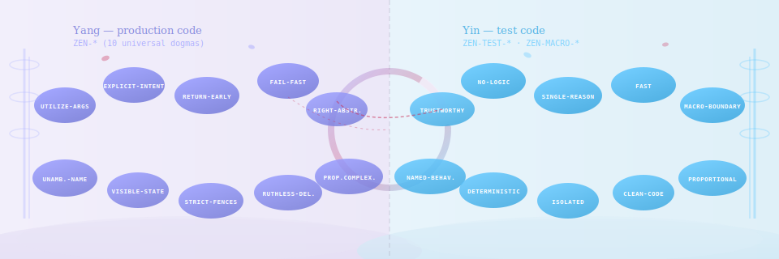

# The Yin-Yang of Code Quality



*In Chinese philosophy, yin and yang are complementary forces — not opposing,
not hierarchical, but two halves of a single whole. Light and shadow. Structure
and flow. The codebase and its tests.*

This project embodies that same duality.

---

## Two Pillars, One System

Every codebase lives a double life. There is the **production code** — the
artifact that ships, that runs, that serves users. And there is the **test
code** — the mirror held up to that artifact, the scaffold of trust that lets
you change anything without fear.

These two worlds operate on different rhythms and different values. A test that
reads like production code has missed the point. Production code with the
structure of a test suite has over-engineered itself into paralysis.

In zen terms:

> **Yang (production code)** — governed by the 10 Universal Dogmas (`ZEN-*`)
> **Yin (test code)** — governed by 10 Testing Tactics (`ZEN-TEST-*`) and 10 Testing Strategy (`ZEN-MACRO-*`) dogmas

Neither pillar is more important. Neither is a subset of the other. Together
they form a complete picture of code quality.

---

## The Symmetry Table

Every Universal Dogma casts a shadow in test space. Some shadows are direct
mirrors; others refract through a different lens at the strategy level.

| Production (Yang) `ZEN-*` | Primary Testing Mirror (Yin) `ZEN-TEST-*` | Strategy Mirror `ZEN-MACRO-*` |
|---|---|---|
| `ZEN-UTILIZE-ARGUMENTS` | *(bridged via `ZEN-TEST-TRUSTWORTHY`)* | — |
| `ZEN-EXPLICIT-INTENT` | `ZEN-TEST-NO-LOGIC` · `ZEN-TEST-DOCUMENTED-INTENT` | `ZEN-MACRO-TRACEABILITY` |
| `ZEN-RETURN-EARLY` | *(bridged via `ZEN-TEST-SINGLE-REASON`)* | — |
| `ZEN-FAIL-FAST` | `ZEN-TEST-FAST` · `ZEN-TEST-TRUSTWORTHY` | `ZEN-MACRO-FLAKINESS` |
| `ZEN-RIGHT-ABSTRACTION` | *(strategy level only)* | `ZEN-MACRO-BOUNDARY` |
| `ZEN-UNAMBIGUOUS-NAME` | `ZEN-TEST-NAMED-BEHAVIOR` | `ZEN-MACRO-VISIBILITY` |
| `ZEN-VISIBLE-STATE` | `ZEN-TEST-DETERMINISTIC` | `ZEN-MACRO-REALITY-CHECK` |
| `ZEN-STRICT-FENCES` | `ZEN-TEST-ISOLATED` | `ZEN-MACRO-INTEGRATION` |
| `ZEN-RUTHLESS-DELETION` | `ZEN-TEST-CLEAN-CODE` | `ZEN-MACRO-EVOLVABILITY` |
| `ZEN-PROPORTIONATE-COMPLEXITY` | `ZEN-TEST-SINGLE-REASON` · `ZEN-TEST-PROPORTIONAL` | `ZEN-MACRO-RISK` |

---

## The Three Indirect Bridges

Three Universal Dogmas do not have a direct one-to-one testing counterpart.
Instead they manifest obliquely — which is itself philosophically meaningful.

!!! note "Bridge 1: `ZEN-UTILIZE-ARGUMENTS` → `ZEN-TEST-TRUSTWORTHY`"
    In production code, unused arguments signal dead weight in an API's
    contract. In test code, the analogous failing is a test that does not
    actually exercise the behaviour it claims to test — a test with an
    assertion that can never fail, or a mock that swallows every call
    silently. *Exercising all arguments is what makes tests trustworthy.*

!!! note "Bridge 2: `ZEN-RETURN-EARLY` → `ZEN-TEST-SINGLE-REASON`"
    Early return in production code is about eliminating deeply nested
    branches — keeping the happy path obvious and the error path isolated.
    In a test, the equivalent discipline is verifying exactly one reason
    for failure per test. A test with ten assertions across unrelated
    behaviours is the testing equivalent of a ten-level nested conditional.
    *Tests that verify single reasons per test naturally enforce early-exit
    thinking.*

!!! note "Bridge 3: `ZEN-RIGHT-ABSTRACTION` → `ZEN-MACRO-BOUNDARY`"
    Choosing the right abstraction in production code — not over-abstracting,
    not under-abstracting — has a direct parallel in the testing world, but
    it manifests at the *strategy* level rather than the *tactics* level. The
    question "should this be a unit test, an integration test, or an end-to-end
    test?" is a question of abstraction. Placing a test at the wrong layer is
    the testing equivalent of choosing the wrong abstraction. *The right test
    abstraction (unit vs integration vs E2E) is captured at the strategic level
    by `ZEN-MACRO-BOUNDARY`.*

---

## Philosophy Roots

The Testing Tactics dogmas (`ZEN-TEST-*`) are grounded in three canonical
traditions:

- **F.I.R.S.T.** (Fast, Isolated, Repeatable, Self-validating, Timely) — the
  five properties that make unit tests trustworthy
- **Clean Code** (Robert C. Martin) — the discipline of treating test code
  with the same craft as production code
- **Kent Beck's Test Desiderata** — the 12 properties of good tests, including
  isolation, composability, and behavioural naming

The Testing Strategy dogmas (`ZEN-MACRO-*`) are grounded in:

- **V-Model** — requirements traceability from specification to test
- **Test Pyramid** — the insight that different test layers have different
  cost-benefit profiles
- **ASPICE** — automotive process maturity, where test ownership and
  traceability are first-class quality concerns
- **Testing Manifesto** — "testing throughout" rather than "testing at the end"

---

## Detector Architecture Consequence

This yin-yang duality is not merely philosophical — it is structural.

!!! tip "The universal detector bridge"
    Every language pipeline is composed of two layers that together provide
    complete dogma coverage:

    1. **Language-specific bindings** — `DetectorBinding` entries in each
       language's `mapping.py`, with empty `universal_dogma_ids=[]`.
       The registry infers the correct `ZEN-*` IDs from the rule's
       `PrincipleCategory`.

    2. **Universal bindings** — `UNIVERSAL_DETECTOR_MAP` from
       `core/universal_mapping.py`, merged via the `DetectorGearbox`:

    ```python
    GEARBOX = DetectorGearbox(language="python")
    GEARBOX.extend(DETECTOR_MAP.bindings)          # language-specific
    GEARBOX.extend(UNIVERSAL_DETECTOR_MAP.bindings) # universal layer
    DETECTOR_MAP = GEARBOX.build_map()
    ```

    Together they guarantee that all 10 `ZEN-*` dogmas are represented in
    every language's analysis, even if a particular language lacks a rule
    for a given dogma.

!!! tip "Why framework detectors have explicit `universal_dogma_ids`"
    Framework test detectors (`PytestSleepDetector`, `JestNoExpectDetector`,
    etc.) carry *explicit* `ZEN-TEST-*` IDs because the inference engine
    operates over language rules (`ZenPrinciple` entries), and test framework
    rules live in a separate namespace. Explicit binding is also more honest:
    a sleep detector in a test suite is unambiguously about `ZEN-TEST-FAST`
    and `ZEN-TEST-DETERMINISTIC` — and stating that directly is the testing
    equivalent of `ZEN-EXPLICIT-INTENT` itself.

### The Purity Contract

| Layer | Dogma tier used | How set |
|---|---|---|
| Production language detectors | `ZEN-*` only | Inferred by registry from `PrincipleCategory` |
| Universal production detectors | `ZEN-*` only | Explicit in `UNIVERSAL_DETECTOR_MAP` |
| Framework test detectors | `ZEN-TEST-*` (and/or `ZEN-MACRO-*`) | Explicit in `DetectorBinding` |
| Universal test detectors | `ZEN-TEST-*` only | Explicit in `UNIVERSAL_TESTING_MAP` |

The `scripts/validate_dogma_consistency.py` script enforces this contract at
every CI run:

- Production `mapping.py` files: `FULL_DOGMA_IDS` must be a subset of
  `UNIVERSAL_DOGMA_IDS` — no `ZEN-TEST-*` or `ZEN-MACRO-*` IDs allowed
- Framework `mapping.py` files: each `DetectorBinding` must carry at least one
  explicit testing-tier ID — blanket `FULL_DOGMA_IDS` assignments are rejected
- Production `DetectorBinding` entries: must not reference `ZEN-TEST-*` or
  `ZEN-MACRO-*` IDs

---

## A Closing Thought

> *The Tao that can be named is not the eternal Tao.*

Code quality cannot be captured by a single dimension. A codebase that scores
perfectly on all 10 Universal Dogmas but has a brittle, flaky, undocumented
test suite is not a healthy codebase. A test suite that achieves full coverage
while the production code violates `ZEN-STRICT-FENCES` at every turn is
covering a house of cards.

The yin-yang of this project says: both layers matter, both layers have their
own grammar, and the health of a codebase is only fully visible when both
pillars are examined together.
